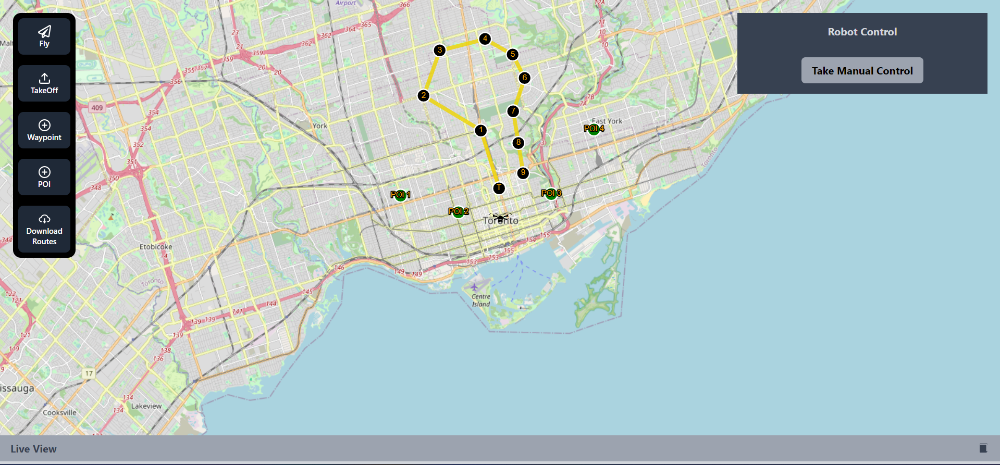
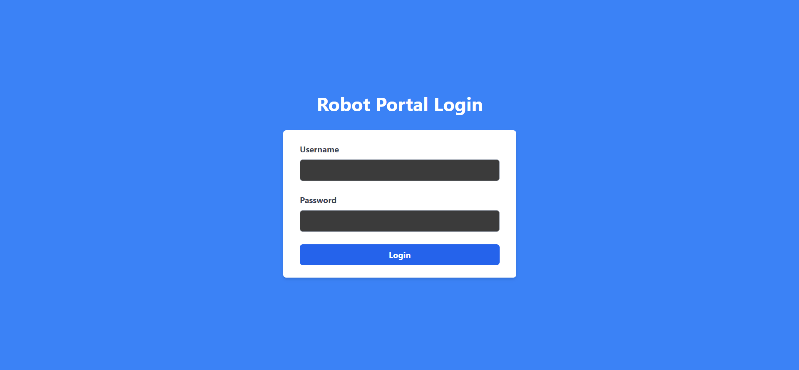
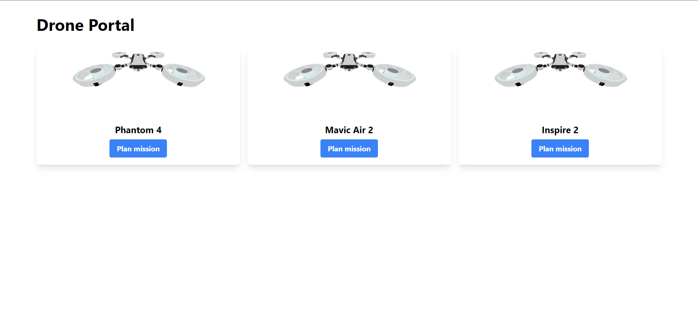

<a name="readme-top"></a>
<div align="center">

  <h1>A Web Based Ground Control Station</h1>
  
  <p>
    A Web/Based GCS Portal to showcase some UI/UX Functionalities built with Next.js, React.js, Three.js and much more 
  </p>
   
</div>

<br />

<!-- Table of Contents -->
<details>

<summary>

# :notebook_with_decorative_cover: Table of Contents

</summary>

- [:notebook\_with\_decorative\_cover: Table of Contents](#notebook_with_decorative_cover-table-of-contents)
  - [:star2: About the Project](#star2-about-the-project)
    - [:file\_folder: Folder Structure](#file_folder-folder-structure)
    - [:tv: Live Demo Link](#tv-live-demo-link)
    - [:page\_facing\_up: App Sections](#page_facing_up-app-sections)
      - [Login](#login)
      - [Drone Portal](#drone-portal)
      - [Mission Planner Map](#mission-planner-map)
    - [:space\_invader: Tech Stack](#space_invader-tech-stack)
  - [:toolbox: Getting Started](#toolbox-getting-started)
    - [:gear: Installation](#gear-installation)
      - [Step 1:](#step-1)
      - [Step 2:](#step-2)
      - [Step 3:](#step-3)
      - [Step 4:](#step-4)
      - [Step 5:](#step-5)
    - [:running: Run Locally](#running-run-locally)
      - [Step 1:](#step-1-1)
      - [Step 2:](#step-2-1)
  - [:handshake: Contact](#handshake-contact)
  - [:gem: Acknowledgements](#gem-acknowledgements)
  - [:credit\_card: Credits](#credit_card-credits)

</details>  

<!-- About the Project -->
## :star2: About the Project

<div align="center">
  
</div>

<br />

This repository is made to showcase a robot user interface made using open scoured code, it uses Open Layers library for the map based functionality and Three.js for displaying 3d Models of a drone :rocket:

<!-- Folder Structure -->
### :file_folder: Folder Structure

Here is the folder structure of this website.
```bash
ground-control-station/
|- public/
|- readme_assets/
|- src/
  |-- atoms/
  |-- components/
  |-- pages/
  |-- types/
  |-- wrappers/
|- .eslintrc.json
|- .gitignore
|- README.md
|- next.config.js
|- package-lock.json
|- package.json
|- postcss.config.js
|- tailwind.config.js
|- tsconfig.config.js
```
<br />

<!-- Live Demo -->
### :tv: Live Demo Link
<a href="https://ground-control-station-saumya11mehta.vercel.app/">Click here to go to the demo site !!</a>

<!-- App Sections -->
### :page_facing_up: App Sections

#### Login
<div align="center">
  
</div>

A basic mock login just enter any email & password to login!

#### Drone Portal
<div align="center">
  
</div>

A portal which lists all the available drones and displays their 3D models, From here you can further plan missions for the drone

#### Mission Planner Map
<div align="center">
  
</div>

Here you can add and visualize your mission takeoff points, waypoints, POIs (Point of Interest) for your drone mission and also download the csv for the same to obtain CSV routes


<!-- TechStack -->
### :space_invader: Tech Stack

[](https://skillicons.dev)

<p align="right">(<a href="#readme-top">back to top</a>)</p>

<!-- Getting Started -->
## :toolbox: Getting Started

<!-- Installation -->
### :gear: Installation

#### Step 1:
Download or clone this repo by using the link below:

```bash
 https://github.com/saumya11mehta/ground-control-station
```

#### Step 2:

ground-control-station uses NPM (Node Package Manager), therefore, make sure that Node.js is installed by executing the following command in console:

```bash
  node -v
```

#### Step 3:

At the main folder execute the following command in console to get the required dependencies:

```bash
  npm install
```

#### Step 4:

At the main folder execute the following command in console to create a build directory with a production build of the GCS:

```bash
  npm run build
```

#### Step 5:

At the main folder execute the following command in console to run the server:

```bash
  npm run start
```

<!-- Run Locally -->
### :running: Run Locally

#### Step 1:

At the main folder execute the following command in console to get the required dependencies:

```bash
  npm install
```

#### Step 2:

At the main folder execute the following command in console to run the development server:

```bash
  npm run dev
```

<p align="right">(<a href="#readme-top">back to top</a>)</p>

<!-- Contact -->
## :handshake: Contact

Saumya Mehta : [Linked In](https://www.linkedin.com/in/saumya-raghuvir-mehta/)

Project Link: [https://github.com/saumya11mehta/ground-control-station](https://github.com/saumya11mehta/ground-control-station)

<p align="right">(<a href="#readme-top">back to top</a>)</p>

<!-- Acknowledgments -->
## :gem: Acknowledgements

Useful resources and libraries that were used in GCS

 - [React](https://react.dev/)
 - [Next JS](https://nextjs.org/)
 - [Tailwind CSS](https://tailwindcss.com/)
 - [Open Layers](https://openlayers.org/)
 - [Jotai](https://jotai.org/)
 - [Three JS](https://threejs.org/)

<!-- Credits -->
## :credit_card: Credits
 - "Light Drone" (https://skfb.ly/o7wBu) by kawuru is licensed under Creative Commons Attribution (http://creativecommons.org/licenses/by/4.0/).


<p align="right">(<a href="#readme-top">back to top</a>)</p>

<p align="center">

</p>
